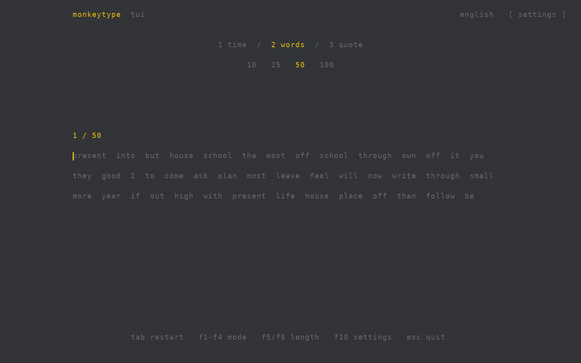

# monkeytype-tui

A fullscreen terminal typing test inspired by [Monkeytype](https://github.com/monkeytypegame/monkeytype). It has time, word, and quote modes, inline corrections, and a WPM graph.

[](docs/media/typing-demo.mp4)

[Watch the typing demo as MP4](docs/media/typing-demo.mp4). It shows a Ghostty shell launch, a corrected typo, and a skipped word. The typing footage is rendered from the native executable's terminal output and sped up for the preview.

See [recording in an Amp orb](docs/recording.md) for the development and demo environment.

## Get started

Download a standalone executable from [GitHub Releases](https://github.com/selimsandal/monkeytype-tui/releases) for Linux, macOS, or Windows (x64 or ARM64). Unpack it, then run `monkeytype-tui` or `monkeytype-tui.exe` in an interactive terminal. The default test is English, time 30, with punctuation and numbers off.

To run from source, install Node.js 20.10+ and pnpm:

```sh
cd monkeytype-tui
pnpm start
pnpm start --words 50
pnpm start --time 30
pnpm start --mode quote --quote-length medium
pnpm start --text "one two three" --stop-on-error word
pnpm test
```

Source runs have no runtime dependencies. Each native archive includes `LICENSE`; use the release's `SHA256SUMS` to verify downloads. macOS binaries are not notarized.

## Use the test

The fullscreen interface uses the serika-dark palette, a centered three-line test, a mode bar, and a results graph of WPM, raw speed, and errors. The first two lines stay in place; after entering the third, each new line scrolls the active line into the middle with a line ahead.

| Key | Action |
| --- | --- |
| F1 / F2 / F3 | Time / words / quote mode |
| F4 | Custom text, when started with `--text` |
| F5 / F6 | Cycle time, word count, or quote length |
| F10 | Open or close settings |
| Tab | Restart |
| Backspace / Ctrl+W | Erase a character / erase a word |
| Esc / Ctrl+C | Quit |

Click mode and length labels to select them. In settings, use Up/Down to select, Left/Right or Enter to change, and Esc to close; clicking a setting cycles its value. Changing a setting or opening the menu during an active test starts a fresh test.

Settings include English, Spanish, French, German, and Turkish word lists and quotes from Monkeytype; punctuation and numbers for generated time/words tests; and difficulty, stop/delete on error, confidence, strict space, freedom, and quick end. Choices are saved to `~/.config/monkeytype-tui/settings.json` on Linux/macOS or `%APPDATA%\monkeytype-tui\settings.json` on Windows. Run `node src/cli.js --help` for the full set of options.

Incorrect characters and missed letters appear red, extra characters dark red, correct characters light, and untyped characters muted. Extra letters appear inline while typing; after moving on, they are hidden and the word is underlined, while the result still counts them. Space commits a partially typed word in normal mode. Backspace edits the current word, and Ctrl+W or Ctrl+Backspace clears it. From an empty word, deletion can return to a previous incorrect word; it cannot return to an already correct word unless `--freedom` is set. The timer starts with the first accepted character.

## Updates and builds

Standalone executables check the public GitHub release on startup. On Linux and macOS, a newer version installs before the test opens. On Windows, the current test opens while the update waits to replace the executable after the test closes. Run `monkeytype-tui update` to check and install manually; on Windows this starts the replacement in the background and prints a log path if it fails. Updates download the archive for your OS and architecture, verify its SHA-256 checksum, and replace the executable in place. Keep the executable in a writable directory; an offline or failed startup check leaves the current version usable. Source runs with `pnpm start` do not update automatically.

Every push to `main` runs tests and publishes a release named `0.0.<commit-unix-time>-g<7-character-sha>`, following the generated identity format used by harness. The commit timestamp and SHA keep the version stable across workflow reruns. `monkeytype-tui --version` prints the embedded identity. For a local build, install Bun 1.3.10 and run `sh scripts/build-release.sh`; its six archives and checksums appear in `dist/`.

## Scope

This is an initial port of the input loop, not feature parity with the website. Time, word, and quote modes and custom space-separated text work. Punctuation generation covers sentence capitalization, periods, and commas; Monkeytype's full punctuation rules, newline/code input, IME composition, funboxes, replays, website statistics, and account features are not implemented. Terminal key and mouse handling depends on the emulator; Ctrl+W is available when Ctrl+Backspace is sent as plain Backspace.
